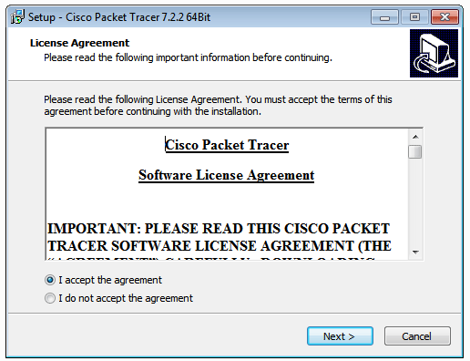
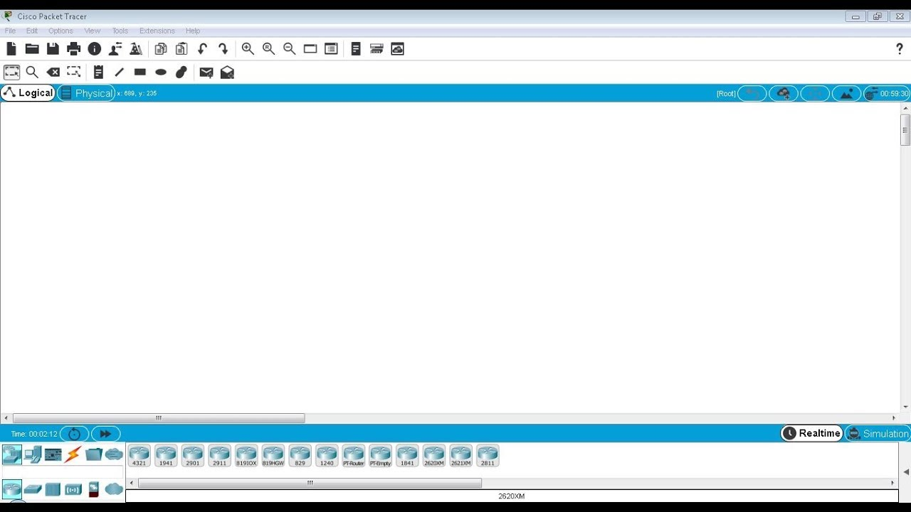
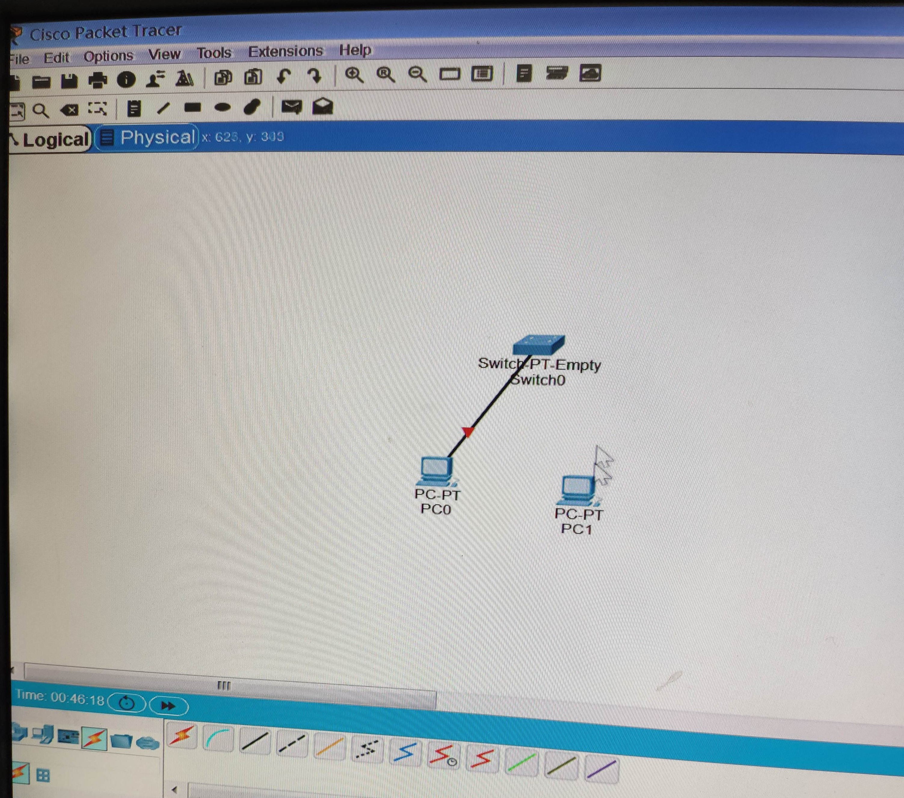
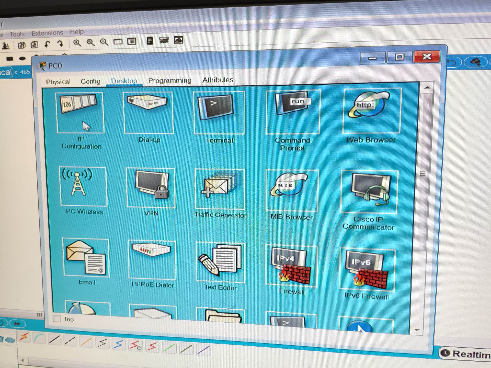
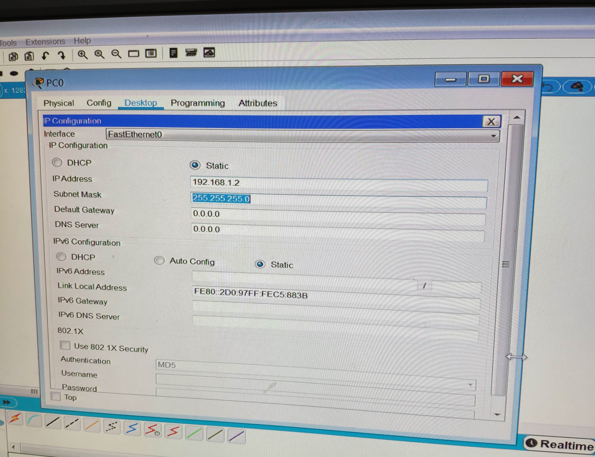
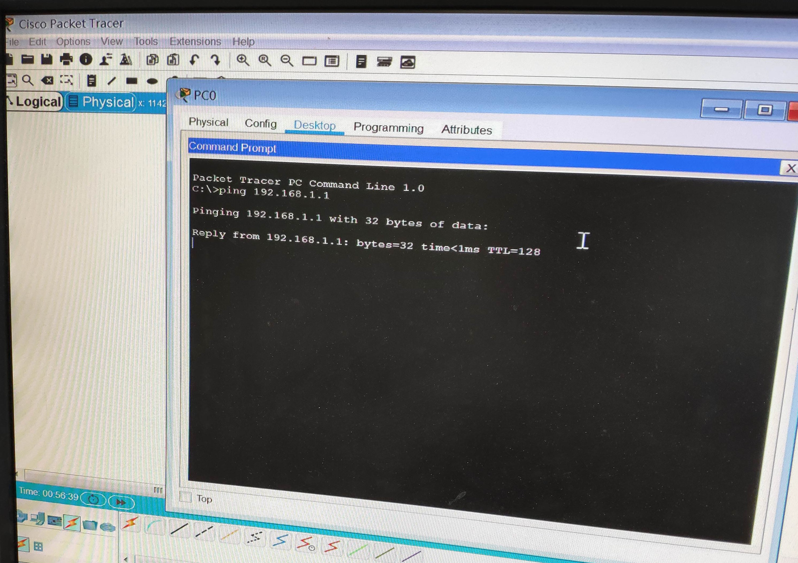
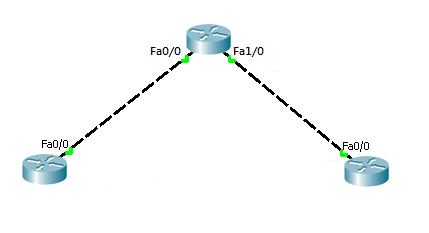
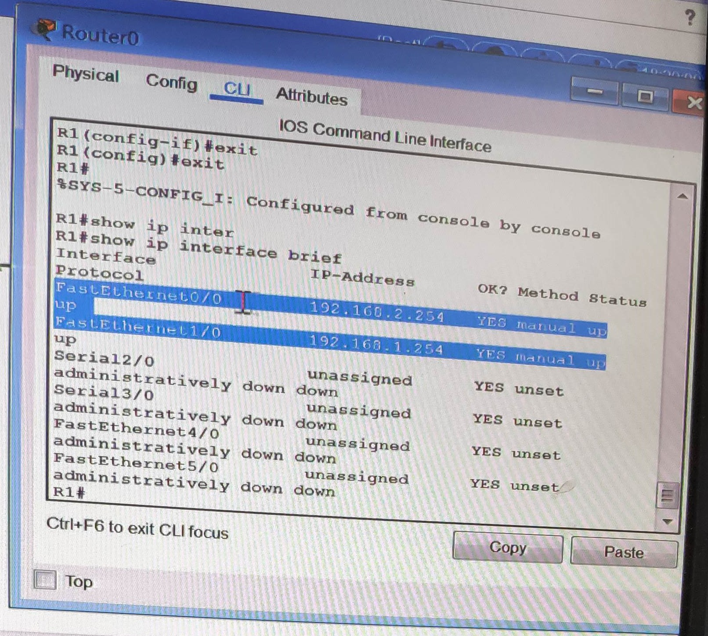

# 介紹 Cisco Packet Tracer (9/10)

是一個模擬器可以模擬 cisco 的設備如 switch、router 等

## 安裝 cisco packet tracer

1. 首先到官方網站去下載Packet Tracer <br/>
<http://www.cisco.com/web/learning/netacad/course_catalog/PacketTracer.html>

2. 下載後依照安裝精靈開始安裝
<br/>


3. 安裝完成後啟動 Packet Tracer
<br/>


## 建置一個簡易網路環境

1. 依序點開 PC 設定檔
<br/>


2. 在 desktop 中選取 ip configuration
<br/>


3. 設定 ip address 以及 subnet mask，依序新增兩組 ip 為 192.168.1.1/24 及 192.168.1.2/24
<br/>


4. 點開其中一台虛擬 PC 在 desktop 中選擇 command prompt，測試 ping 另一台是否成功
<br/>


## router 設定

1. 新增拓樸如下
<br/>


```
Router(config)# hostname R1

R1(config)# interface fastEthernet 0/0
R1(config-if)# ip address 192.168.2.254 255.255.255.0
R1(config-if)# no shutdown
R1(config-if)# exit

R1(config)# int fa1/0
R1(config-if)#  ip address 192.168.1.254 255.255.255.0
R1(config-if)# no shut
R1(config-if)# ip interface brief
```

2. 輸入 ip interface brief 後得到的結果
<br/>
