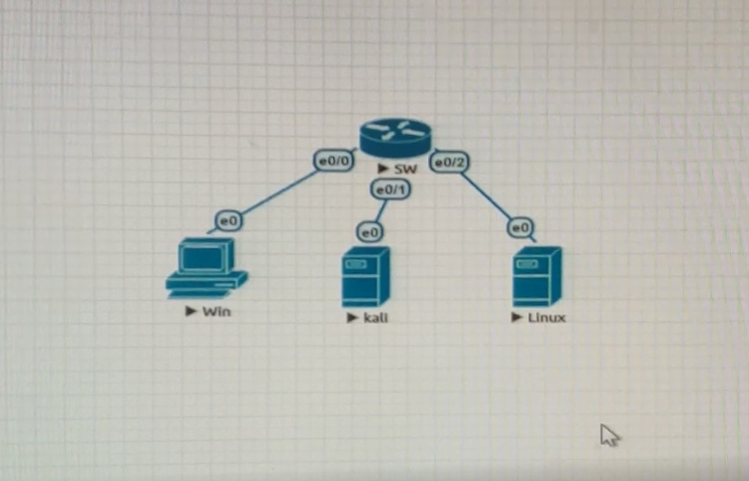

# 監聽 (9/24)

架設環境如下，一台switch、windows、kali linux、tiny linux

將三台虛擬機 ip 依序設為 192.168.1.1、192.168.1.2、192.168.1.3 ( ip addr add 192.168.1.xxx/24 brd + dev eth0 )

在 kali 中輸入 tcpdump -nni eth0 icmp

tcpdump 可用來擷取通過某網路介面的封包

-nn：直接以 IP 及 port number 顯示，而非主機名與服務名稱

-i：指令要監控的網路介面，如 eth0、lo、any 等

icmp：只抓取 icmp 的封包

