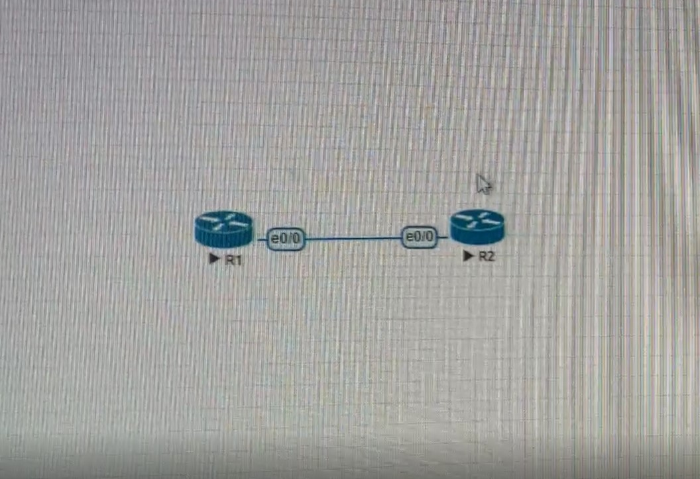
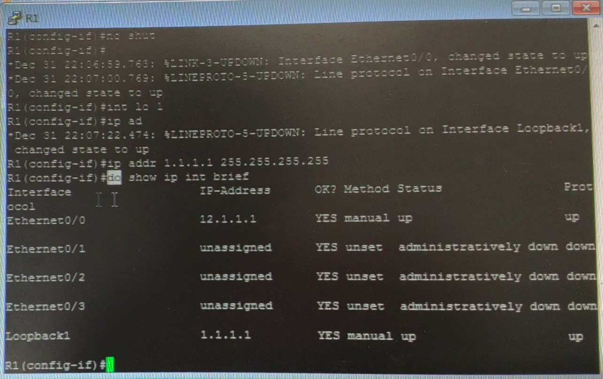
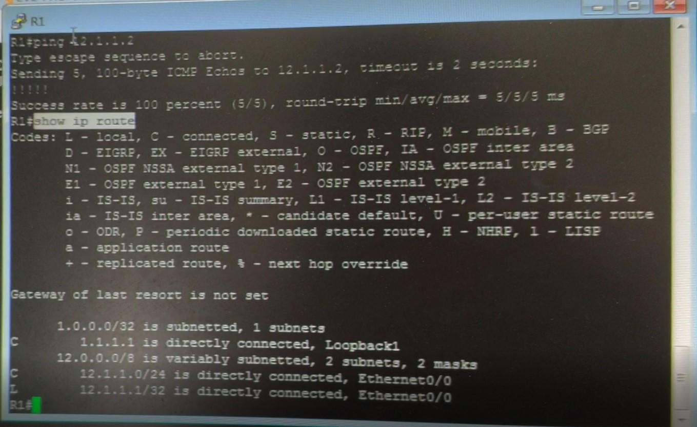
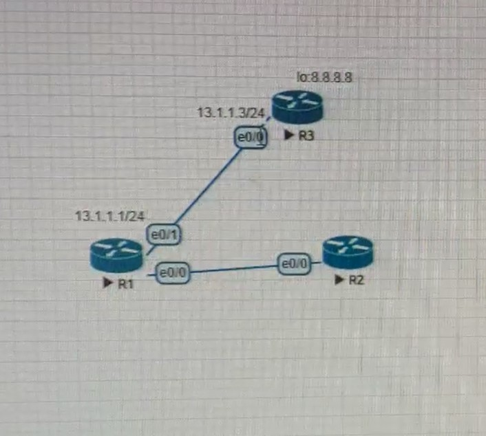

# 路由器設定 (10/1)

```
en
conf t
hostname R1
int e0/0
ip addr 12.1.1.1 255.255.255.0
no shut
int lo 1
ip addr 1.1.1.1 255.255.255.255
do show ip int brief
以相同方式不同 IP 配置第二台

R1 > ping 12.1.1.2
.!!!!
第一封包為了執行 ARP 解析，所以第一個封包會被丟棄

show ip route 在路由器裡面看路由表

ping x.x.x.x repeat 數字   ( 重複ping '數字' 次 ) 

ping x.x.x.x source y.y.y.y   ( ping 來源 y.y.y.y )

ip route 1.1.1.1 255.255.255.255 12.1.1.1  ( 將第二台機器新增去第一台的路徑 )
```

Address Resolution Protocol ( ARP 位址解析協定 )

是一個通過解析網路層位址來找尋資料鏈路層位址的網路傳輸協定








## 三台路由器

預設路由（Default route），是對IP數據包中的目的地址找不到存在的其他路由時，路由器所選擇的路由。目的地不在路由器的路由表里的所有數據包都會使用預設路由

IPv4預設路由是0.0.0.0/0

```
ip route 0.0.0.0 0.0.0.0 13.1.1.3 ?     觀看可添加參數，預設值為 0
no ip route 0.0.0.0 0.0.0.0 13.1.1.3    取消路由設定

do show ip static route 0.0.0.0/0       觀看到某一位址的路徑有多少條，全數列出，此路由屬於靜態路由 

debug ip icmp                           觀測封包
```




Cisco Express Forwarding ( CEF 思科快遞交換)
CEF可以將 route lookup 的結果保存在 CEF Table，當 router 再次收到同一個 Destination 的 Packet 的話，不用再次尋找 route table