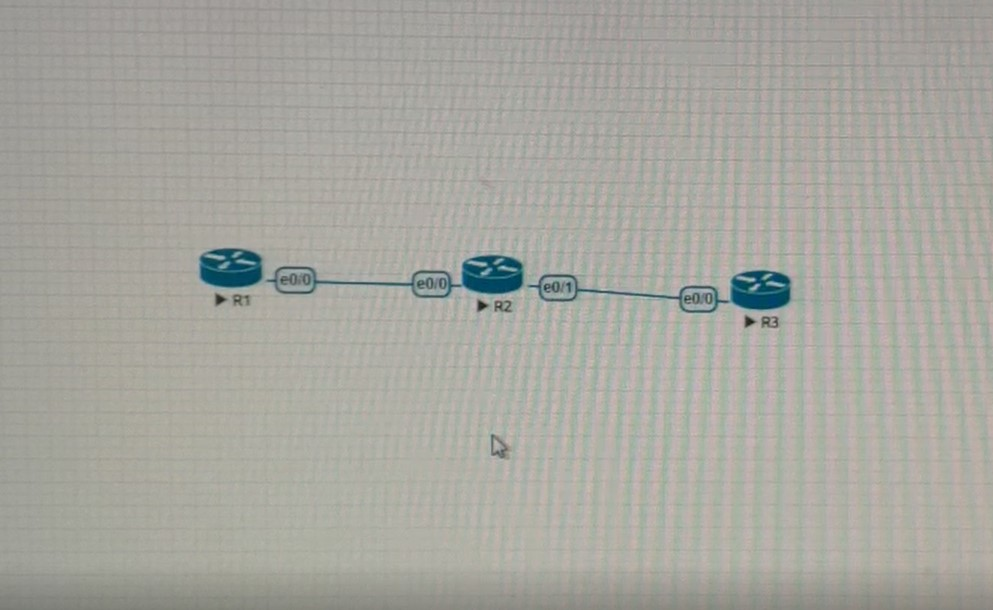
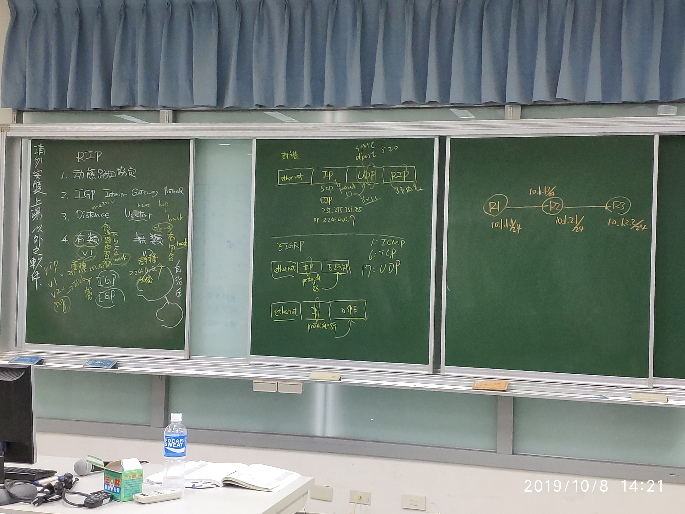
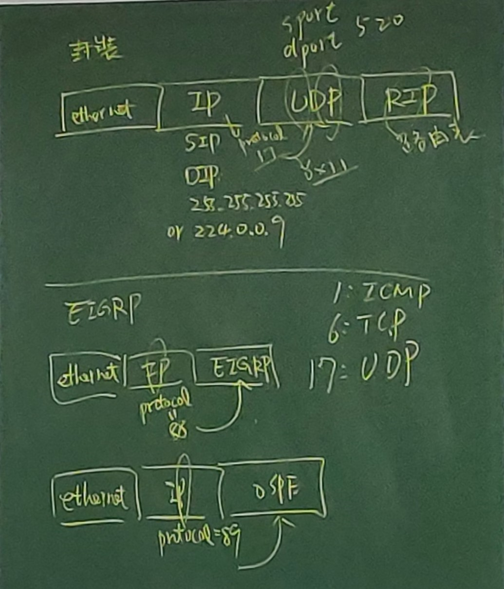
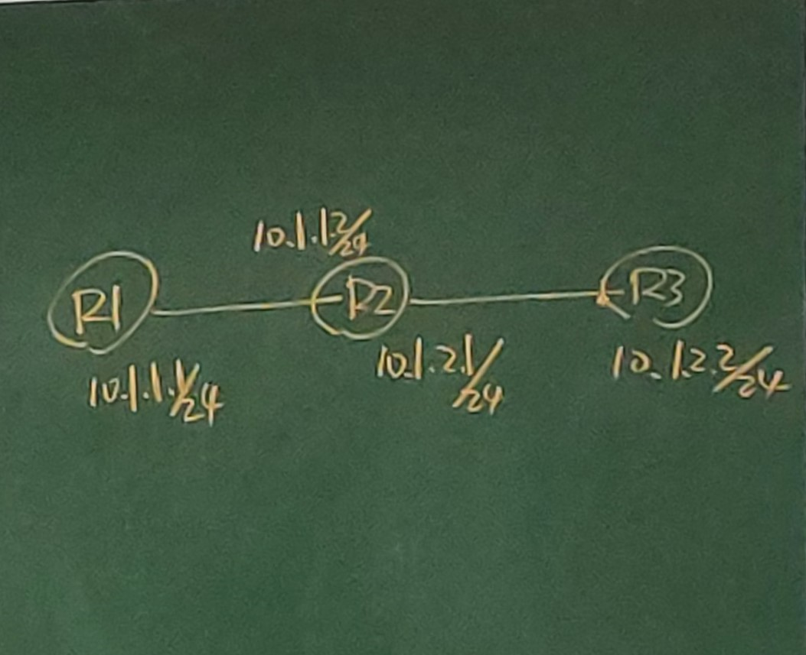

# RIP 協定 (10/8)

R1 設定如下
```
en
conf t
hostname R1
int e0/0
ip addr 10.1.1.1 255.255.255.0
no shut
exit
router rip
network 10.1.1.1
do show run
```

R2 設定如下
```
hostname R2 {
  interface Ethernet 0/0
  ip address 10.1.1.2 255.255.255.0
  interface Ethernet 0/1
  ip address 10.1.2.1 255.255.255.0
}
router rip
  version 2
  network 10.1.2.1
```

R3 設定如下
```
hostname R3 {
  interface Ethernet 0/0
  ip address 10.1.2.2 255.255.255.0

}
router rip
  version 2
  network 10.1.2.2
```







