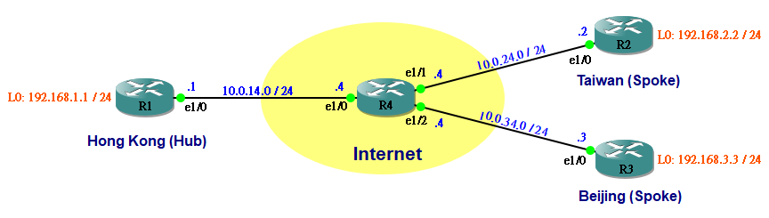
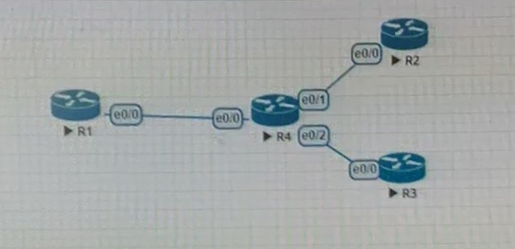

# Generic Routing Encapsulation (GRE) (10/22)

GRE 可以在兩個 Physical interface 之間建立點對點 Tunnel，多用於設置 Virtual Private Network(VPN) 去保護資訊

先建立以下拓樸





## 在 R1 R2 之間建立 tunnel
```
R1> int tunnel 12
R1> ip address 172.16.12.1 255.255.255.0
R1> tunnel source ethernet 1/0
R1> tunnel destionation 10.0.24.2
```
```
R2> int tunnel 12
R2> ip address 172.16.12.2 255.255.255.0
R2> tunnel source ethernet 1/0
R2> tunnel destionation 10.0.14.1
```

在 R1 R3 之間建立 tunnel
```
R1> int tunnel 13
R1> ip address 172.16.13.1 255.255.255.0
R1> tunnel source ethernet 1/0
R1> tunnel destionation 10.0.34.3
```
```
R2> int tunnel 13
R2> ip address 172.16.13.2 255.255.255.0
R2> tunnel source ethernet 1/0
R2> tunnel destionation 10.0.14.1
```
確認 R1、R2、R3 是否互相連通
```
R1> ping 172.16.12.2 source 172.16.12.1
R1> ping 172.16.13.3 source 172.16.12.1

R2> ping 172.16.13.3 source 172.16.12.2
R2> traceroute 172.16.13.3 route 172.16.12.2    traceroute 為從你的電腦到互聯網另一端的主機是走的什麼路徑，會發現路徑是 R2 > R1 > R3，因為是 Hub-to-spoke Topology
```
## Routing Protocol

利用 EIGRP 將 Router 背後的網路互相發布

```
R1> router eigrp 1
R1> network 172.16.12.0 0.0.0.255    0.0.0.255 為反掩碼
R1> network 172.16.13.0 0.0.0.255
R1> network 192.168.1.0
R1> no auto-summary                  

auto summary
這個命令的作用是關閉路由協議的自動匯總功能,主要是為了解決不連續子網互相訪問的問題,在這種情況下都會關閉自動匯總,而採用手工匯總的方式通告路由 

R2> router eigrp 1
R2> network 172.16.12.0 0.0.0.255    0.0.0.255 為反掩碼
R2> network 192.168.2.0
R2> no auto-summary                  


R3> router eigrp 1
R3> network 172.16.13.0 0.0.0.255    0.0.0.255 為反掩碼
R3> network 192.168.3.0
R3> no auto-summary  
```

查看 EIGRP 是否成功交換路由表
```
show ip route eigrp 1
traceroute 172.168.12.3 source 172.16.12.2
```