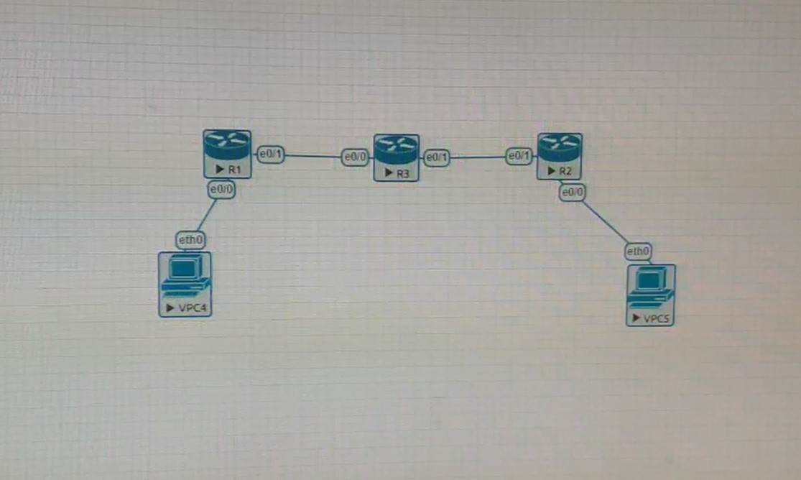
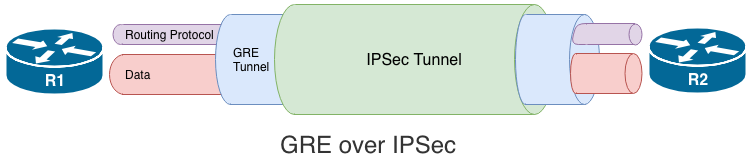
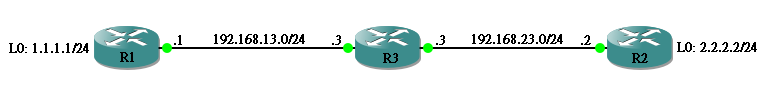

# IPSec (10/29)



```
R1 e0/0 為 192.168.10.1 255.255.255.0
   e0/1 為 192.168.13.1 255.255.255.0

ip route 0.0.0.0 0.0.0.0 192.168.13.3

ip access-list extended VPN-traffic
permit ip 192.168.10.0 0.0.0.255 192.168.20.0 0.0.0.255
```

```
R2 e0/0 為 192.168.20.1 255.255.255.0
   e0/1 為 192.168.23.2 255.255.255.0

ip route 0.0.0.0 0.0.0.0 192.168.23.3

ip access-list extended VPN-traffic
permit ip 192.168.20.0 0.0.0.255 192.168.10.0 0.0.0.255
```

```
R3 e0/0 為 192.168.13.3 255.255.255.0
   e0/1 為 192.168.23.3 255.255.255.0
```

```
R1> crypto isakmp policy 1
R1> encryption aes
R1> hash md5
R1> authentication pre-share
R1> group 2
R1> exit
R1> crypto ipsec transform-set TS esp-3des ah-sha-hmac
R1> exit
R1> crypto isakmp key 6 ccie address 192.168.23.2

R1> crypto map CMAP 1 ipsec-isakmp
R1> set peer 192.168.23.2
R1> set transforn-set TS
R1> match address VPN-Traffic
R1> exit
R1> int e0/0
R1> crypto map CMAP
```

```
R2> crypto isakmp policy 1
R2> encryption aes
R2> hash md5
R2> authentication pre-share
R2> group 2
R2> exit
R2> crypto ipsec transform-set TS esp-3des ah-sha-hmac
R2> exit
R2> crypto isakmp key 6 ccie address 192.168.13.1

R2> crypto map CMAP 1 ipsec-isakmp
R2> set peer 192.168.13.1
R2> set transforn-set TS
R2> match address VPN-Traffic
R2> exit
R2> int e0/1
R2> crypto map CMAP
```

```
VPC4> ip 192.168.10.10 255.255.255.0 gateway 192.168.10.1

VPC5> ip 192.168.20.10 255.255.255.0 gateway 192.168.20.1
```

# GRE over IPSec vs IPSec over GRE


GRE Tunnel 並無加密功能，流經 Internet 的資訊變得不安全，這時候 GRE 可與 IPSec 一起應用

IPSec：數據機密性、數據完整性、身分驗證、防重放攻擊

## GRE over IPSec



第一個方法是 GRE over IPSec，即 IPSec 在最外層(或稱最底層)。意思是先在 R1 與 R2 之間建立 IPSec Tunnel，把裡面的 GRE Tunnel 整個進行加密，Routing Protocol 在 GRE Tunnel 裡面完成 Route 交換，最後 Data 在 GRE Tunnel 裡面傳送。從下圖所見，因整個 GRE Tunnel 被加密，所以裡面的 Routing Protocol 及 Data 都會被加密



```
R1 lo   為 1.1.1.1 255.255.255.0
   e1/0 為 192.168.13.1 255.255.255.0

ip route 192.168.23.0 255.255.255.0 192.168.13.3
```

```
R2 lo   為 2.2.2.2 255.255.255.0
   e1/0 為 192.168.23.2 255.255.255.0

ip route 192.168.13.0 255.255.255.0 192.168.23.2
```

```
R3 e1/0 為 192.168.13.3 255.255.255.0
   e1/1 為 192.168.23.3 255.255.255.0
```

接著確認只有 192.168.13.1 能 ping 192.168.23.2

```
R1> ping 192.168.23.25 source 192.168.23.1
!!!!!

R2> ping 2.2.2.2 source 1.1.1.1
.....
```

```
R1> ip access-list extended IPSEC_TUNNEL
R1> permit ip host 192.168.13.1 host 192.168.23.2
```

```
R2> ip access-list extended IPSEC_TUNNEL
R2> permit ip host 192.168.23.2 host 192.168.13.1
```