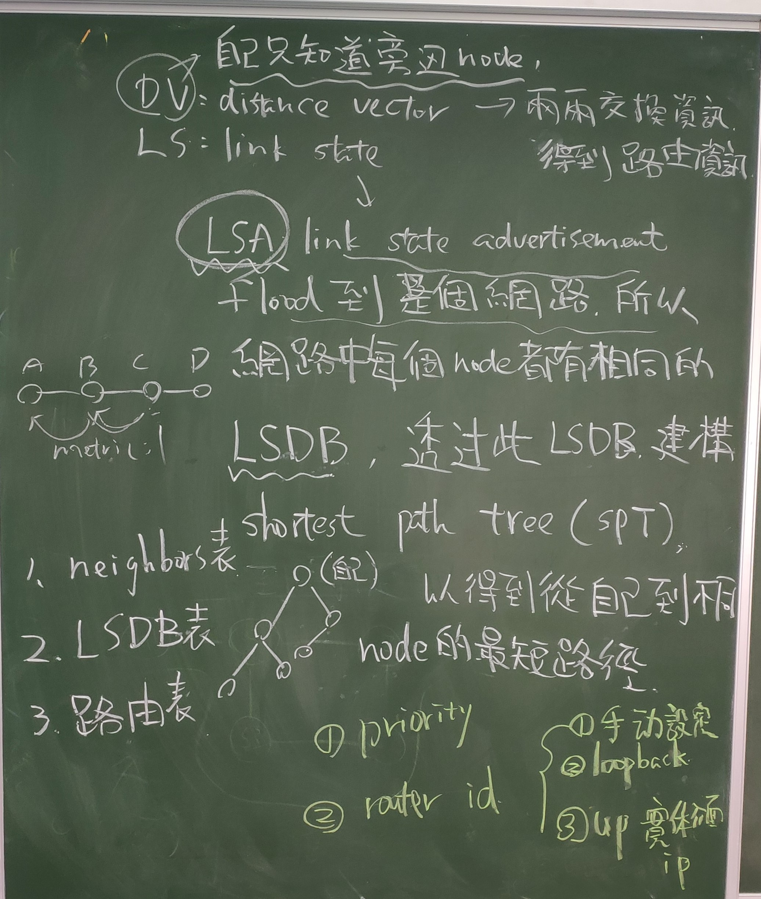

# OSPF (11/5)





Open Shortest Path First (開放最短路由優先協定)

OSPF 屬於 Link-State Routing Protocol (內定路由)，每隻在 OSPF 裡的 Router 都會向鄰近的 Router 交換自己的 Link-State，當 Router 收到這些 Link-State 之後，就會運用 Dijkstra Algorithm (戴克斯特拉算法) 來計算出最短的路徑 (Shortest Path)

OSPF 中 Area 的概念，是設計給大型網路使用的，為了解決管理上的問題，OSPF 使用 Hierarchical System (分層系統)，把大型的 OSPF 分割成多個 Area (區域) 去做設定，Area 有兩個表達方式，可以是一個 16 Bits 的數字 (由 0 至 65,535 )，或者用類似 IP 的方式，例如：192.168.1.1

DR (designated router 指定路由器)
  推選出來和其他路由器相連並互相交換資訊，若沒有相連則不交換資訊
  建立 type 2 network LSA 並 flooding 到該 AREA
  協助該 AREA 上拓樸資料的交換

BDR (備援指定路由器)
  只接收不散播，並保持最新資訊，以防止 DR 壞掉可即時更新，若無則選擇修鮮度高為 BDR

DROTHER 
  不是 DR 也不是 BDR 的 router


Neighbor 與 Adjacency

OSPF Neighbor vs OSPF Adjacency
```
In short, two OSPF routers are neighbors if they are connected to the same subnet and share a series of common configuration information:

Same Area ID
Same Area type
Same subnet mask
Same timers
Same authentication
They see their own OSPF RID in each other's Hello packet
In essence, OSPF neighborhood is a relation of two routers that allows them to see and understand each other but nothing more. In particular, two OSPF neighbors do not exchange any routing information - the only packets they exchange is Hello packets.

OSPF adjacency is formed betwen selected neighbors and allows them to exchange routing information. So, two routers must first be neighbors, only then they can become adjacent. Two routers become adjacent if:

At least one of them is DR or BDR (on multiaccess type networks), or
They are interconnected by a point-to-point or point-to-multipoint network type
So, to sum it up, OSPF neighbors are simply routers that sit on the same segment and hear each other, but they do not engage in any closer cooperation. OSPF adjacent routers exchange routing information.
```
引用自： <https://community.cisco.com/t5/switching/ospf-neighbor-v-ospf-adjacency/td-p/1576785>


使用 router ospf < process id>  啟動 OSPF，兩隻要成為 Neighbor 的 Router 不需要擁有相同的 ID

使用 network < network no > < wildcard > area < area id > 來宣告那一個 Interface 會參與 OPSF，參與 OSPF 的 Interface 會發佈 Hello packet 嘗試與對方成為 Neighbor，然後再成為 Adjacency，在之後發佈的 link 資訊中亦會包含此網段


```
R1 e0/0 為 192.168.12.1 255.255.255.0
   
   router ospf 1
   network 192.168.12.0 0.0.0.255 area 10
```

```
R2 e0/0 為 192.168.12.2 255.255.255.0
   e0/1 為 192.168.23.2 255.255.255.0

   router ospf 1 
   network 192.168.12.0 0.0.0.255 area 10
   network 192.168.23.0 0.0.0.255 area 0
   
```

```
R3 e0/1 為 192.168.23.3 255.255.255.0

   router ospf 1 
   network 192.168.23.0 0.0.0.255 area 0
```
```
show ip ospf neighbor

Neighbor ID    Pri   State     Dead Time  Address       Interface
192.168.23.3     1   Full/DR   00:00:35   192.168.23.3  Ethernet0/1
192.168.12.1     1   Full/BDR  00:00:32   192.168.12.1  Ethernet0/0
```

Neighbor ID
  這邊的 ID 是對方的 "名字"，這邊剛好用對方 IP 命名，

Pri
  優先值，用來判斷誰來做 DR，Priority 比較大的 Router 會成為 DR，第二大的會成為 BDR，其他就會成為 DROTHER

Dead Time
  OSPF 預設的 Hello Interval 是 10 秒，即是說 OSPF 會每 10 秒鐘向 Neighbor 傳送 Hello Message，對方接收到後會回應，但如果經過 Dead Interval 40 秒也收不到對方回覆，就判斷對方出了問題下線了。所以在成為 Neighbor 之後，Dead Time 由 40 秒開始倒數，通常數到 30 秒，就會因為收到 Hello Message 而重設為 40 秒，但是如果倒數到 0 秒也收不到 Hello，就判斷對方死了

Address
  對方的 IP 位址

```
R1> router ospf 1                Router OSPF 設定
R1> network 192.168.12.0 0.0.0.255 area 10
R1> area 10 authentication
 
R1> int e0/0                     設定 interface 密碼
R1> ip ospf authentication
R1> ip ospf authentication-key Password

R1> router ospf 1                設定 MD5 密碼
R1> network 192.168.12.0 0.0.0.255 area 10
R1> area 10 authentication message-digest
R1> int e0/0
R1> ip ospf message-digest-key 10 md5 Password
```