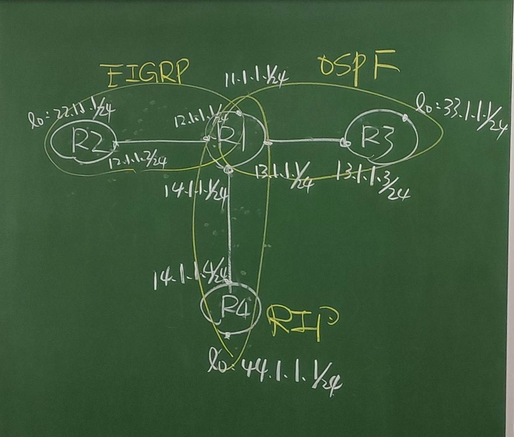
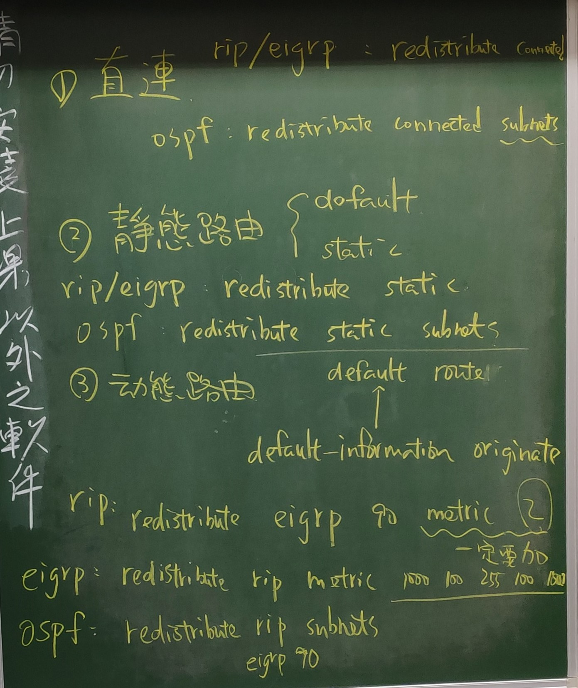
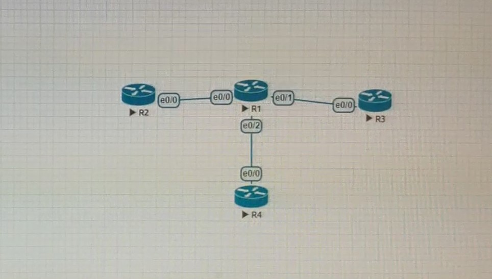
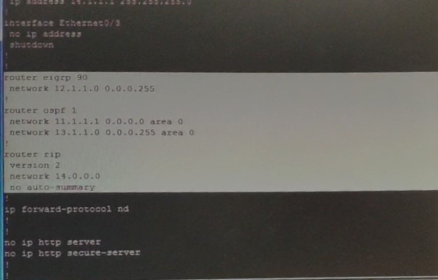
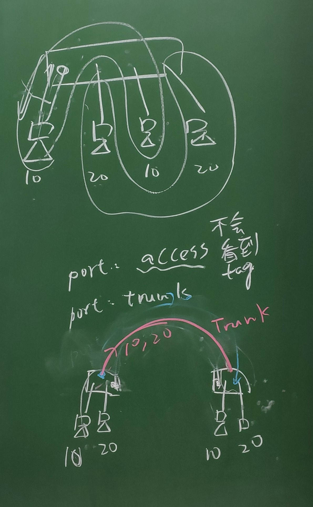
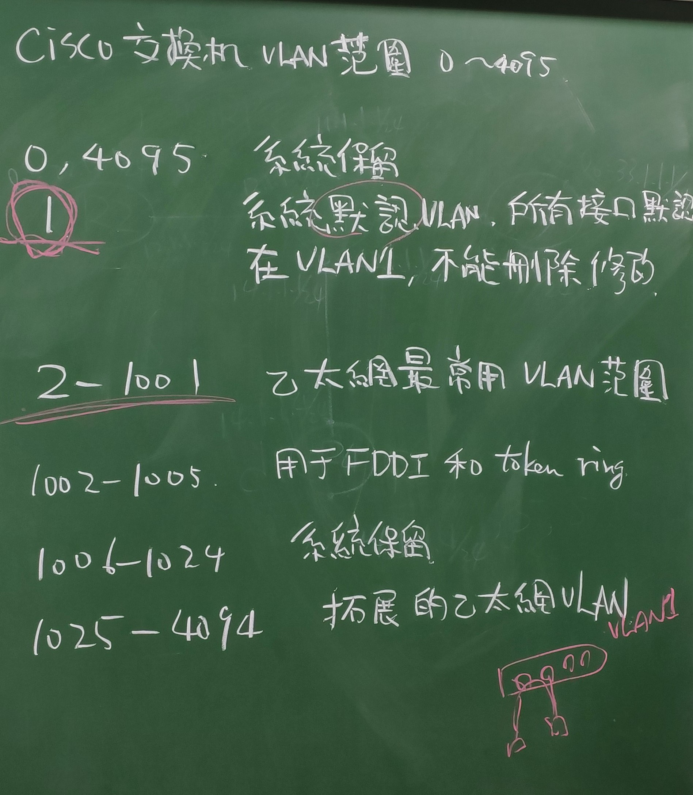
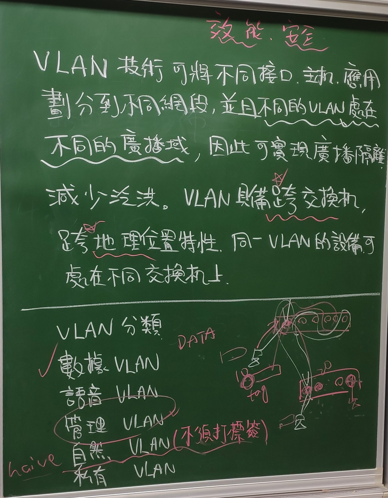
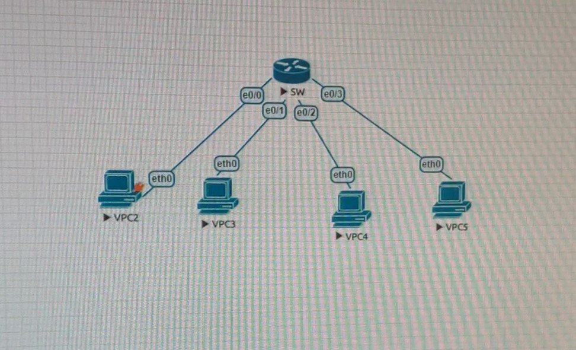

# EIGRP + OSPF + RIP (11/19)





```
R1> int lo 0
R1> ip addr 11.1.1.1 255.255.255.0
R1> int e0/0
R1> ip addr 12.1.1.1 255.255.255.0
R1> no shut
R1> int e0/1
R1> ip addr 13.1.1.1 255.255.255.0
R1> no shut
R1> int e0/2
R1> ip addr 14.1.1.1 255.255.255.0
R1> no shut
R1> do show ip int brief
```

依照上面步驟設定其他機器

```
R2 lo   22.1.1.1/24       EIGRP
   e0/0 12.1.1.2/24

R3 lo   33.1.1.1/24       OSPF
   e0/0 13.1.1.3/24

R4 lo   44.1.1.1/24       RIP
   e0/0 14.1.1.4/24
```

```
R2> router eigrp ?
R2> router eigrp 90
R2> no auto-summary
R2> network 12.1.1.0 0.0.0.255
R2> network 22.1.1.1 0.0.0.0

R1> router eigrp 90
R1> no auto-summary
R1> network 12.1.1.0 0.0.0.255
R1> network 22.1.1.1 0.0.0.1
R1> do show ip route eigrp

R3> router ospf ?
R3> router ospf 1
R3> network 13.1.1.0 0.0.0.255 area 0
R3> network 33.1.1.1 0.0.0.0 area 0

R1> router ospf 1
R1> network 13.1.1.0 0.0.0.255 area 0
R1> network 11.1.1.1 0.0.0.0 area 0
R1> do show ip route

R1> router rip
R1> version 2
R1> no auto-summary
R1> network 14.1.1.1

R4> router rip
R4> version 2
R4> no auto-summary
R4> network 14.1.1.4
R4> network 44.1.1.1

R1> do show run
```




## SW + VPC






SW 選 L2

```
VPC2> ip 192.168.1.1
VPC3> ip 192.168.1.2
VPC4> ip 192.168.1.3
VPC5> ip 192.168.1.4

SW> vlan 10
SW> vlan 20
SW> do show vlan
SW> int e0/0
SW> switchport mode access
SW> switchport access vlan 10

SW> int e0/1
SW> switchport mode access
SW> switchport access vlan 20

SW> int e0/2
SW> switchport mode access
SW> switchport access vlan 10

SW> int e0/3
SW> switchport mode access
SW> switchport access vlan 20

SW> exit
SW> show vlan brief
```