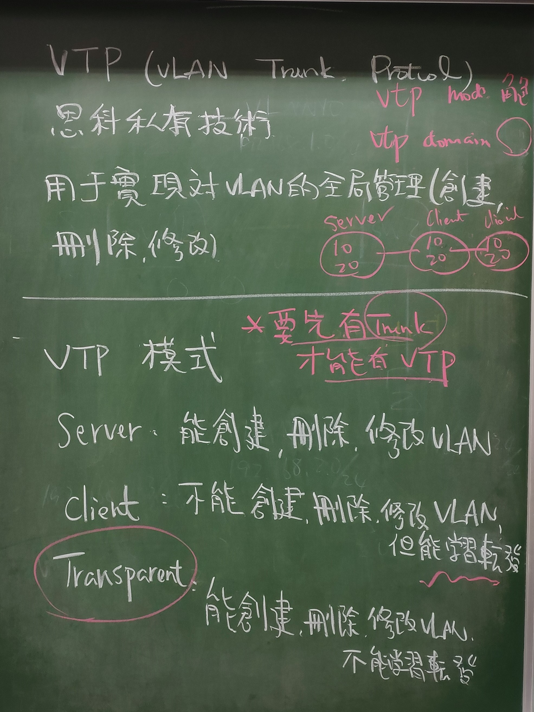

# VLAN 11/26


```
VPC3 192.168.1.1 /24
VPC4 192.168.1.2 /24
VPC5 192.168.2.3 /24
VPC6 192.168.2.4 /24
```

```
SW1> vlan 10
SW1> name aa
SW1> vlan 20
SW1> name bb
SW1> do show vlan brief
SW1> int range e0/0, e0/3
SW1> switchport mode access
SW1> switchport access vlan 10
SW1> exit

SW1> int range e0/1, e0/2
SW1> switchport mode access
SW1> switchport access vlan 20
SW1> exit
```

```
SW2> vlan 10
SW2> name aa
SW2> vlan 20
SW2> name bb
SW2> do show vlan brief
SW2> int range e0/0, e0/3
SW2> switchport mode access
SW2> switchport access vlan 10
SW2> exit

SW2> int range e0/1, e0/2
SW2> switchport mode access
SW2> switchport access vlan 20
SW2> exit

```

## trunk


```
SW2> do show vlan brief
SW2> int e0/2
SW2> switchport trunk encapsulation dot1q
SW2> switchport mode trunk
SW2> switchport trunk allowed (10,20)     括弧內可寫可不寫，寫了代表限定

SW1> vlan 10
SW1> vlan 20
SW1> do show vlan brief
Sw1> int e0/0
SW1> switchport mode access
SW1> switchport access vlan 10

Sw1> int e0/1
SW1> switchport mode access
SW1> switchport access vlan 20

SW1> int e0/2
SW1> switchport trunk encapsulation dot1q
SW1> switchport mode trunk
SW1> do show int trunk
```

## VTP




VLAN Trunking Protocol (VTP) 是 Cisco 專利，主要用作 VLAN 管理。話說要在網絡裡加入一個新的 VLAN，需要在該 VLAN Traffic 所經過的每一隻 Switch 創建此 VLAN使用 VTP 則可以實施中央管理，只需在一隻 VTP Server 新增 VLAN，VLAN 資訊就會自動發怖到其他 Switch，其他 Switch 就會新增此 VLAN。然而 VTP Version 1 及 Version 2 有點缺陷，有機會出現災難性的後果，因此有經驗的網管人員都會避免使用

```
SW1> vtp domain cisco
SW1> vtp password ccna
SW1> vtp mode server
SW1> exit
SW1> show vtp status 

SW1> vlan 10
SW1> vlan 20
SW1> vlan 30

SW1> int e0/0
SW1> switchport trunk encapsulation dot1q
SW1> switchport mode trunk
SW1> do show int trunk
```

```
SW2> vtp domain cisco
SW2> vtp password ccna
SW2> vtp mode client
SW2> exit
SW2> show vtp status 

SW2> int e0/0
SW2> switchport trunk encapsulation dot1q
SW2> switchport mode trunk

SW2> int e0/1
SW2> switchport trunk encapsulation dot1q
SW2> switchport mode trunk
SW2> do show int trunk

SW2> exit
SW2> show vlan brief
```

```
SW3> vtp domain cisco
SW3> vtp password ccna
SW3> vtp mode client
SW3> exit
SW3> show vtp status 

SW3> int e0/0
SW3> switchport trunk encapsulation dot1q
SW3> switchport mode trunk

SW3> exit
SW3> show vlan brief
```