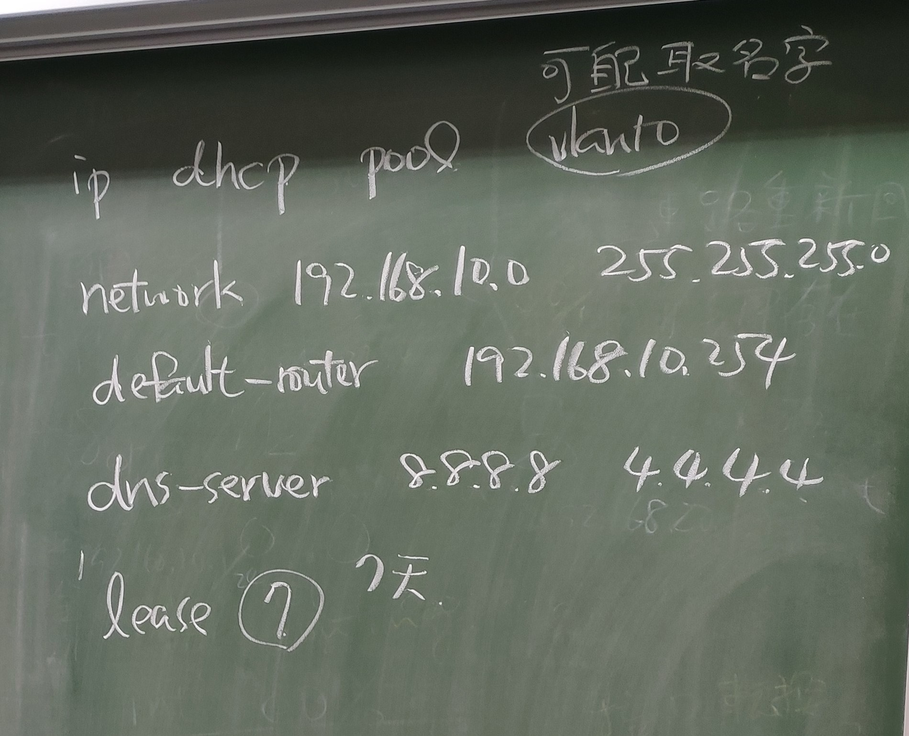
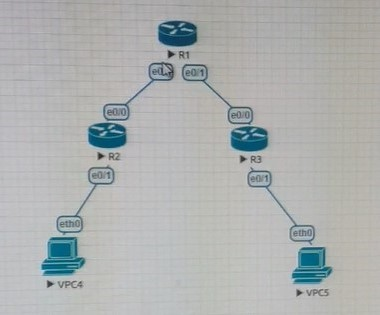

# STP 12/10


```
SW3> show spanning-tree
SW3> spanning-tree uplinkfast

SW2> spanning-tree backbonefast

SW1> spanning-tree backbonefast

SW3> debug spanning-tree events
SW3> int e0/2
SW3> shut
```


假設 VPC2 要傳送資料給 VPC1，但 VPC2 的 ARP Table 裡沒有 VPC1 的 MAC Address，因此 VPC2 送出一個 Broadcast ARP Request 想找 VPC1 的 MAC Address。這個 Broadcast 送到 SW1，由於 SW1 在 e0/2 收到 Broadcast，所以它會把 Broadcast 經由 e0/0 和 e0/1 送出去。同樣地，SW2 在 e0/0 收到後會在 e0/1 和 e0/2 送出去，而 SW3 在 e0/0 收到後，就在 e0/1 和 e0/2 送出去，於是 SW2 和 SW1 又收到來自 SW3 的 Broadcast，然後它們也照樣在另一個出口送出，於是 Broadcast 不會停止地重覆輸送，這就稱為 Broadcast Storm，會造成 Switching Loop 的問題

解決 Broadcast Storm 的方法是把網絡中其中一條連線斷開，阻止 Broadcast 在網絡上遊花園。問題是究竟斷開那一條連線好呢？各個 Switch 應該要有一致的共識，所以就有了 STP 這個機制，讓所有 Switch 溝通一下那些 port 要傳送資料，那些 port 應該休息不要傳送資料


## L3 switch

layer 3 switch 可以當作 router 使用


## SW 與 router 互連


```
VPC1> ip 192.168.10.1 255.255.255.0

VPC2> ip 192.168.20.1 255.255.255.0

SW> vlan 10
SW> vlan 20

SW> int e0/0
SW> switchport mode access
SW> switchport access vlan 10

SW> int e0/1
SW> switchport mode access
SW> switchport access vlan 20

SW> int e0/2
SW> switchport trunk encapsulation dot1q
SW> switchport mode trunk
```

```
R1> int e0/0
R1> no shut
R1> int e0/0.10
R1> dot
R1> en
R1> encapsulation dot1q 10
R1> ip addr 192.168.10.254 255.255.255.0

R1> int e0/0.20
R1> dot
R1> en
R1> encapsulation dot1q 20
R1> ip addr 192.168.20.254 255.255.255.0
R1> do show int brief
```

```
VPC1> ping 192.168.10.254
VPC1> ping 192.168.20.254
VPC1> ping 192.168.20.1
```

```
SW> ip dhcp pool vlan 10
SW> network 192.168.10.0 255.255.255.0
SW> defualt-router 192.168.10.254
SW> dns-server 8.8.8.8 4.4.4.4
SW> exit
SW> ip dhcp excluded-address 192.168.10.250 192.168.10.255

SW> ip dhcp pool vlan 20
SW> network 192.168.20.0 255.255.255.0
SW> defualt-router 192.168.20.254
SW> dns-server 8.8.8.8 4.4.4.4
SW> exit
SW> ip dhcp excluded-address 192.168.20.250 192.168.20.255

```

## dhcp




```
R1> int e0/0
R1> ip addr 192.168.12.1 255.255.255.0
R1> no shut

R1> int e0/1
R1> ip addr 192.168.13.1 255.255.255.0
R1> no shut 

R1> exit
R1> ip dhcp pool mylan1
R1> network 192.168.10.0 255.255.255.0
R1> default-router 192.168.10.254
R1> dns-server 8.8.8.8
R1> exit

R1> ip dhcp pool mylan2
R1> network 192.168.20.0 255.255.255.0
R1> default-router 192.168.20.254
R1> dns-server 8.8.8.8

```


```
R2> int e0/0
R2> ip addr 192.168.12.2 255.255.255.0
R2> no shut

R2> int e0/1
R2> ip addr 192.168.10.254 255.255.255.0
R2> no shut 
R2> do show ip int brief

R2> int e0/1
R2> ip helper-address 192.168.12.1
```

```
R3> int e0/0
R3> ip addr 192.168.12.3 255.255.255.0
R3> no shut

R3> int e0/1
R3> ip addr 192.168.20.254 255.255.255.0
R3> no shut 
R3> do show ip int brief

R3> int e0/1
R3> ip helper-address 192.168.13.1
```