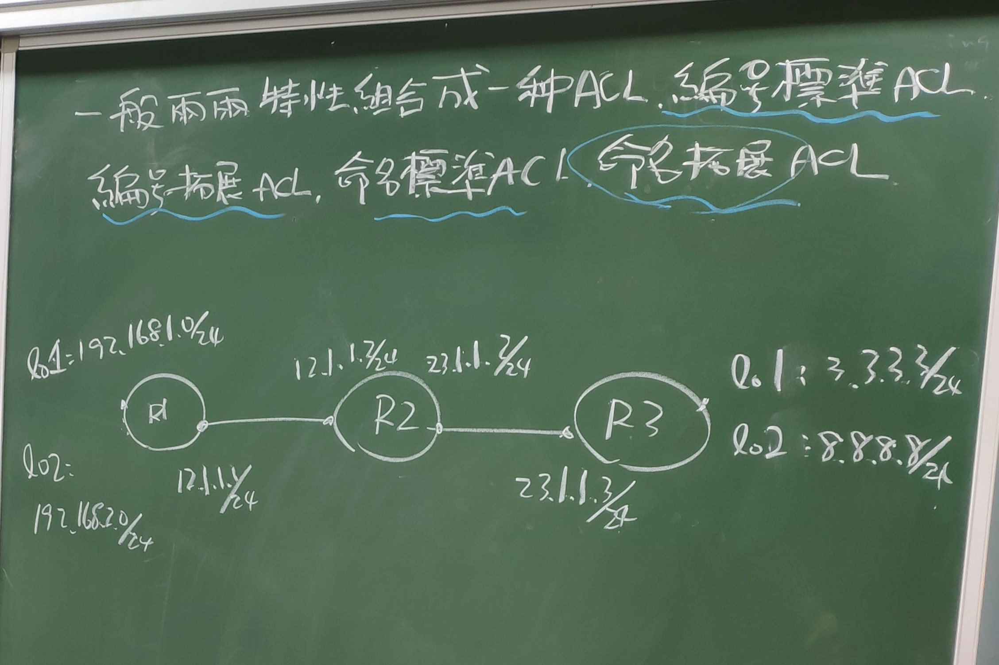
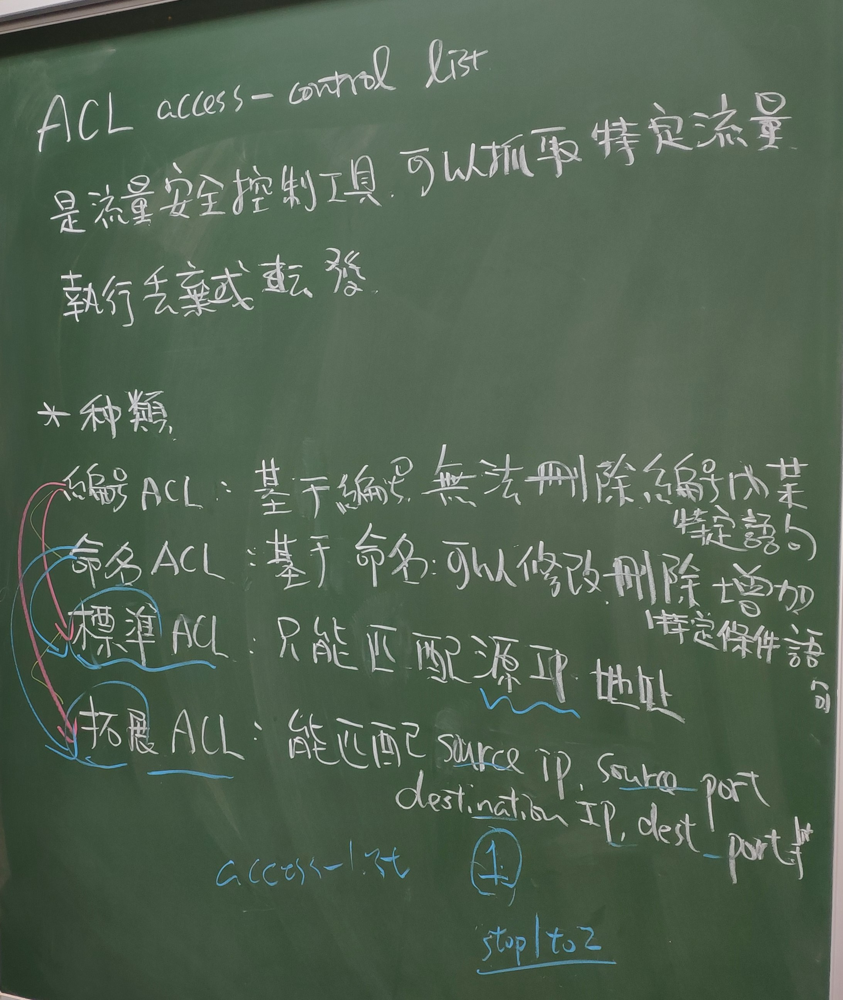
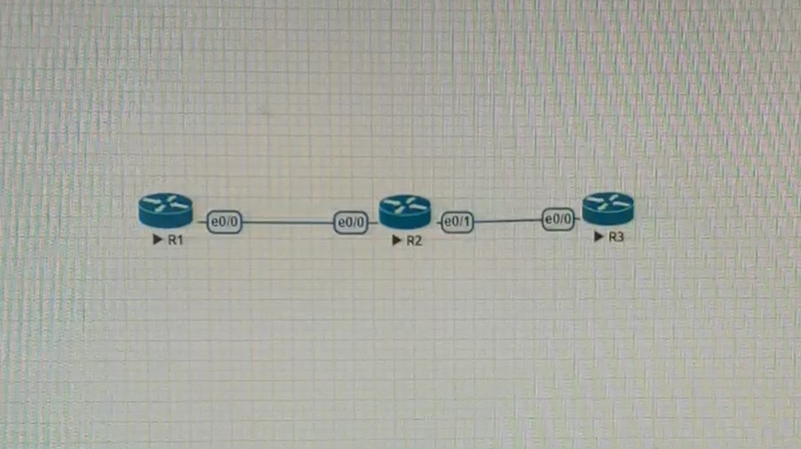

# ACL(12/24)





R1 e0/0 12.1.1.1
   lo1  192.168.1.1
   lo2  192.168.2.1

R2 e0/0 12.1.1.2
   e0/1 23.1.1.2

R3 e0/0 23.1.1.3
   lo1  3.3.3.3
   lo2  8.8.8.8

```
R1> router ospf 1
R1> router-id 1.1.1.1
R1> network 12.1.1.0 0.0.0.255 area 0
R1> network 192.168.1.0 0.0.0.255 area 0
R1> network 192.168.2.0 0.0.0.255 area 0

R2> router ospf 1
R2> router-id 2.2.2.2
R2> network 12.1.1.0 0.0.0.255 area 0
R2> network 23.1.1.0 0.0.0.255 area 0

R3> router ospf 1
R3> router-id 3.3.3.3
R3> network 23.1.1.0 0.0.0.255 area 0
R3> network 3.3.3.3 0.0.0.0 area 0
R3> network 8.8.8.8 0.0.0.0 area 0

R1> do show ip route
R2> do show ip route

R1> ping 3.3.3.3 source 192.168.1.1
R1> ping 8.8.8.8 source 192.168.1.1
R1> ping 3.3.3.3 source 192.168.2.1
```

```
R2> access-list 1 deny 192.168.1.0 0.0.0.255
R2> access-list 1 deny host 192.168.10.1
R2> int e0/0
R2> ip access-group 1 in

(此時 ping 不通)
R1> ping 3.3.3.3 source 192.168.1.1
R1> ping 3.3.3.3 source 192.168.2.1
```

```
R2> access-list 1 permit any
R2> show access-lists 1

(此時 2.1 可以 1.1 不行)
R1> ping 3.3.3.3 source 192.168.2.1
R1> ping 3.3.3.3 source 192.168.1.1
```